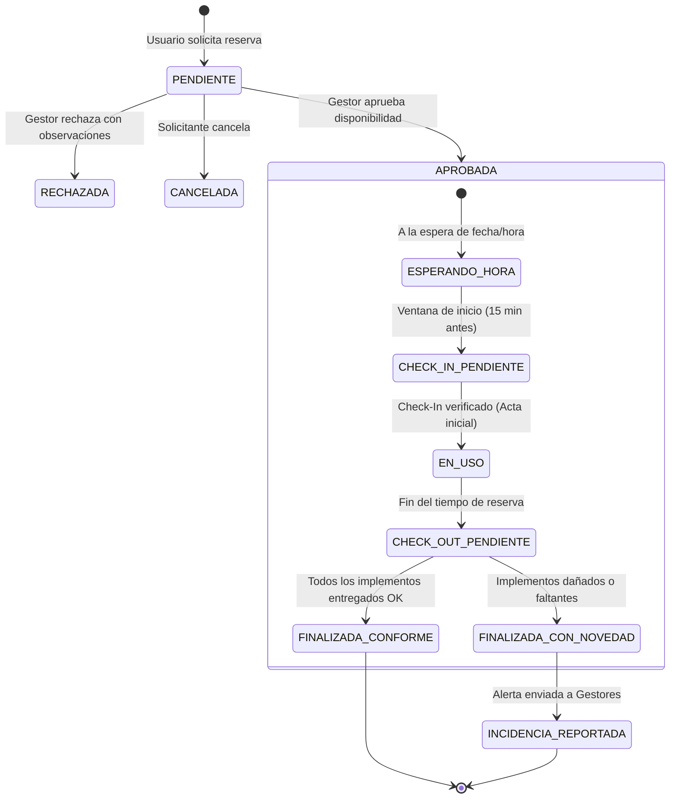

# 🏛️ Contexto Global del Proyecto (PROJECT_CONTEXT)
**Proyecto:** Sistema de Gestión, Reserva de Espacios Físicos y Control de Inventario  
**Institución:** Politécnico Colombiano Jaime Isaza Cadavid  
**Metodología:** Domain-First Spec-Driven Development (SDD)  
**Stack Principal:** Next.js 14+ (App Router) | NestJS 10+ | TypeScript | Prisma ORM | MariaDB 11.x | Tailwind CSS | Zod  

---

## 📌 1. Visión y Propósito del Sistema

El sistema **Uni-Espacios** tiene como objetivo digitalizar, centralizar y optimizar la administración, préstamo y control de los espacios físicos institucionales (aulas de clase, laboratorios especializados, auditorios, salas de cómputo y canchas/espacios deportivos) en el Politécnico Colombiano Jaime Isaza Cadavid.

Además de evitar la colisión horaria entre reservas y la carga académica regular (clases fijas semestrales), el sistema garantiza la **trazabilidad y custodia de los recursos e implementos pedagógicos y deportivos** asignados a cada espacio mediante un flujo riguroso de **verificación de inventario en Check-In y Check-Out**.

---

## 🏢 2. Estructura y Jerarquía Institucional

El modelo físico se estructura de forma jerárquica:

```
[Sede Institucional] (Ej. Sede Medellín - Poblado, Sede Rionegro)
   └── [Bloque / Edificio] (Ej. Bloque P40, Bloque P31, Bloque P19)
         └── [Espacio Físico] (Ej. Aula P40-201, Laboratorio de Física, Cancha Sintética)
               └── [Inventario de Implementos] (Ej. TV 55", Marcadores, Balones, Proyector)
```

### Tipos de Espacios Soportados:
1. **`AULA`**: Aulas magistrales y salones convencionales.
2. **`LABORATORIO`**: Laboratorios de química, física, electrónica, etc., con equipamiento sensible.
3. **`AUDITORIO`**: Espacios de gran aforo para conferencias y eventos académicos.
4. **`DEPORTIVO`**: Canchas sintéticas, coliseo, placas polideportivas, gimnasio.
5. **`SALA_COMPUTO`**: Salas equipadas con estaciones de trabajo de cómputo y software especializado.

---

## 📦 3. Módulo de Inventario y Control de Implementos

Cada espacio físico cuenta con una ficha de inventario activa que detalla los elementos y recursos bajo custodia en dicho recinto.

### Categorías de Implementos:
* **`TECNOLOGIA`**: Televisores, videoproyectores, computadores, sistemas de sonido, cables HDMI/VGA.
* **`DEPORTIVO`**: Balones de fútbol/baloncesto/voleibol, mallas, conos, petos, raquetas.
* **`DIDACTICO`**: Marcadores borrables, borradores de acrílico, punteros láser, maquetas anatómicas.
* **`MOBILIARIO`**: Sillas universitarias, mesas de trabajo, escritorios docentes, podios.

### Estados de un Implemento:
* `OPTIMO`: En perfectas condiciones de operación.
* `REGULAR`: Funcional con desgaste visual leve.
* `DANADO`: Averiado o no operativo (requiere mantenimiento).
* `DE_BAJA`: Retirado del servicio.

---

## 🔄 4. Ciclo de Vida de Reservas y Verificación de Inventario



### Reglas de Negocio del Flujo Check-In / Check-Out:
1. **Check-In (Ingreso al Espacio):**
   * Se habilita desde 15 minutos antes de la hora pactada hasta 20 minutos después.
   * El solicitante o el gestor valida una lista de chequeo digital con los implementos asignados al espacio.
   * Si un ítem ya estaba dañado o ausente al ingresar, se documenta en el acta de Check-In con fotos/notas para no responsabilizar al solicitante actual.
2. **Check-Out (Salida y Devolución):**
   * Debe ejecutarse al culminar la reserva.
   * Se revisa el inventario contra el acta de ingreso.
   * Si se reporta un ítem `FALTANTE` o `PRESENTE_DANADO`, el sistema marca la verificación como `CON_NOVEDADES`, emite una alerta automática al `GESTOR_ESPACIO` e inhabilita preventivamente al solicitante para futuras reservas hasta el esclarecimiento de la novedad.

---

## 🚫 5. Reglas de Negocio y Motor Anti-Solapamiento

1. **Prioridad Académica:** Las `Clases Fijas` de periodos académicos en estado `ACTIVO` tienen prioridad absoluta sobre cualquier reserva puntual.
2. **Prevención de Doble Reserva (Double-Booking):** No pueden existir dos reservas en estado `APROBADA` para el mismo `espacioId` cuyas franjas horarias se intersequen:
   $$(\text{fechaInicio}_A < \text{fechaFin}_B) \quad \land \quad (\text{fechaFin}_A > \text{fechaInicio}_B)$$
3. **Atomicidad e Integridad:** La aprobación y creación de reservas debe ejecutarse dentro de transacciones de base de datos (`prisma.$transaction`) con nivel de aislamiento serializable.
4. **Dominio de Correo Obligatorio:** Registro y autenticación exclusivos para usuarios institucionales con dominio `@elpoli.edu.co`.

---

## 👥 6. Matriz de Roles y Permisos (RBAC)

| Capacidad | ESTUDIANTE / DOCENTE | GESTOR_ESPACIO | SUPERADMIN |
| :--- | :---: | :---: | :---: |
| Consultar catálogo de espacios y su inventario | ✅ | ✅ | ✅ |
| Consultar disponibilidad horaria en tiempo real | ✅ | ✅ | ✅ |
| Solicitar reserva puntual de un espacio | ✅ | ✅ | ✅ |
| Realizar Check-In y Check-Out de su reserva | ✅ | ✅ | ✅ |
| Cancelar su propia reserva pendiente | ✅ | ✅ | ✅ |
| Aprobar / Rechazar reservas de su bloque/facultad | ❌ | ✅ | ✅ |
| Registrar y gestionar inventario de implementos | ❌ | ✅ | ✅ |
| Gestionar Sedes, Bloques y Espacios físicos | ❌ | ❌ | ✅ |
| Cargar Periodos Académicos y Clases Fijas | ❌ | ❌ | ✅ |
| Auditoría global y reporte de novedades | ❌ | ❌ | ✅ |

---

## 💻 7. Arquitectura Tecnológica

* **Frontend:** **Next.js 14+ (App Router)** + **TypeScript** + **Tailwind CSS** + **shadcn/ui** + **TanStack Query v5**.
* **Backend:** **NestJS 10+** + **TypeScript** + **Prisma ORM** + **MariaDB 11.x** + **nestjs-zod** + **Swagger/OpenAPI**.
* **Validaciones y Contratos:** **Zod** agnóstico compartido para validación frontend/backend y generación de esquemas DTOs.
* **Seguridad:** Tokens JWT firmados (Access + Refresh Tokens) con hashing bcrypt para contraseñas.
