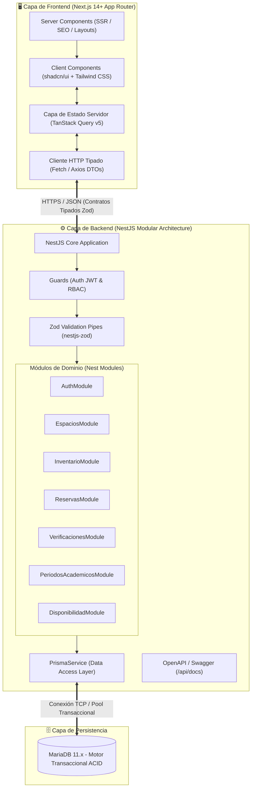
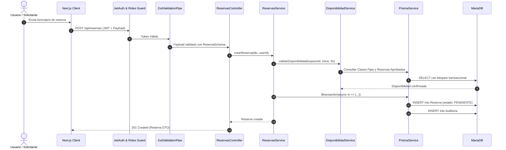
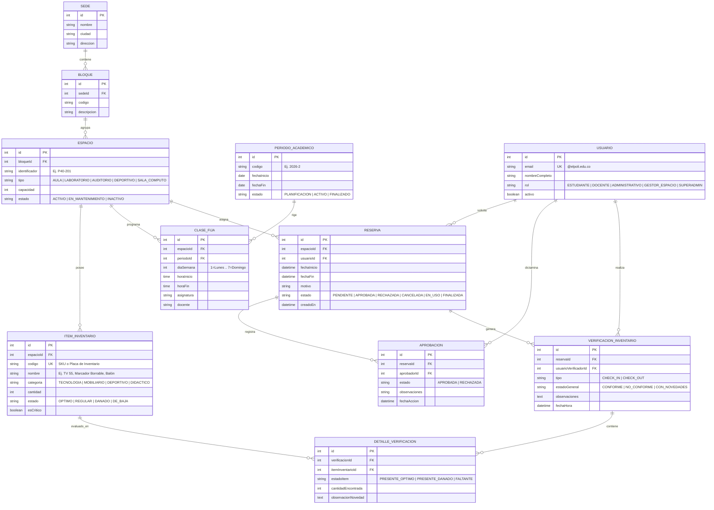

# 🏛️ Descripción General de la Arquitectura (Architecture Overview)
**Proyecto:** Sistema de Gestión, Reserva de Espacios Físicos y Control de Inventario  
**Institución:** Politécnico Colombiano Jaime Isaza Cadavid  
**Metodología:** Domain-First Spec-Driven Development (SDD)  
**Stack:** Next.js 14+ (App Router) | NestJS 10+ | TypeScript | Prisma ORM | MariaDB 11.x | Zod | TanStack Query v5  

---

## 1. Visión General y Contexto del Sistema

El sistema implementa una arquitectura moderna, modular y desacoplada basada en una API RESTful empresarial construida con **NestJS y TypeScript**, persistencia relacional transaccional en **MariaDB** mediante **Prisma ORM**, y un frontend full-stack/SPA optimizado en **Next.js (App Router)** potenciado con **TanStack Query**, **Tailwind CSS** y **shadcn/ui**.



---

## 2. Arquitectura de Backend (NestJS + TypeScript + Prisma)

El backend adopta una arquitectura modular orientada a dominios (DDD-lite) con Inyección de Dependencias (DI), separación de responsabilidades y tipado estricto:

```
backend/src/
├── app.module.ts              # Módulo raíz que orquesta los submódulos
├── main.ts                    # Punto de entrada, configuración de CORS, Swagger y Pipes globales
├── common/                    # Elementos transversales compartidos
│   ├── decorators/            # Decoradores personalizados (@CurrentUser, @Roles, @Public)
│   ├── filters/               # HttpExceptionFilter global y PrismaClientExceptionFilter
│   ├── guards/                # JwtAuthGuard, RolesGuard (RBAC)
│   └── pipes/                 # ZodValidationPipe
├── config/                    # ConfigModule, validación de variables de entorno con Zod
├── prisma/                    # PrismaModule y PrismaService (gestión de conexión y transacciones)
└── modules/                   # Módulos encapsulados por entidad/dominio
    ├── auth/                  # AuthModule: Login institucional, JWT, Refresh Tokens
    ├── sedes/                 # SedesModule: CRUD de Sedes institucionales
    ├── bloques/               # BloquesModule: CRUD de Bloques físicos
    ├── espacios/              # EspaciosModule: Catálogo, filtros facetados y tipos de espacio
    ├── inventario/            # InventarioModule: Gestión de implementos y recursos por espacio
    ├── disponibilidad/        # DisponibilidadModule: Motor anti-solapamiento y cálculo de franjas
    ├── reservas/              # ReservasModule: Creación, cancelación y ciclo de vida de reservas
    ├── verificaciones/        # VerificacionesModule: Check-In, Check-Out y actas de novedades
    └── periodos-academicos/   # PeriodosAcademicosModule: Semestres y Clases Fijas recurrentes
```

### Flujo de Ejecución de una Solicitud de Reserva con Inventario


---

## 3. Modelo Relacional de Dominio (ERD Completo)

El modelo de datos normalizado soporta la jerarquía física, el calendario académico, las reservas y el **inventario con verificaciones de Check-In y Check-Out**:



---

## 4. Motor de Detección de Conflictos (Anti-Solapamiento)

El algoritmo de validación de disponibilidad evalúa de manera transaccional dos fuentes de bloqueo para un intervalo objetivo $[T_{ini}, T_{fin}]$ en un `espacioId`:

### 1. Validación de Clases Fijas Semestrales
Para la fecha objetivo $D = \text{date}(T_{ini})$:
1. Buscar el `PeriodoAcademico` donde $D \in [\text{fechaInicio}, \text{fechaFin}]$ y $\text{estado} = \text{'ACTIVO'}$.
2. Si existe periodo activo, calcular el día de la semana $dia = \text{dayOfWeek}(D)$ y los horarios $H_{ini} = \text{time}(T_{ini})$, $H_{fin} = \text{time}(T_{fin})$.
3. Consultar colisiones en `CLASE_FIJA` cumpliendo:
   $$\text{horaInicio} < H_{fin} \quad \land \quad \text{horaFin} > H_{ini} \quad \land \quad \text{diaSemana} = dia$$

### 2. Validación de Reservas Existentes
Consultar en `RESERVA` para el mismo `espacioId`:
$$\text{estado} \in \{\text{'APROBADA'}, \text{'EN_USO'}\} \quad \land \quad \text{fechaInicio} < T_{fin} \quad \land \quad \text{fechaFin} > T_{ini}$$

### 3. Estrategia de Concurrencia (Isolation & Locking)
* Las consultas y escrituras se ejecutan dentro de una transacción atómica `prisma.$transaction(..., { isolationLevel: 'Serializable' })` garantizando que no existan condiciones de carrera (anti double-booking) ante peticiones concurrentes.

---

## 5. Arquitectura de Frontend (Next.js 14+ App Router + TanStack Query)

```
frontend/src/
├── app/                       # Enrutamiento App Router de Next.js
│   ├── (auth)/                # Rutas de autenticación (login, registro)
│   │   ├── login/page.tsx
│   │   └── register/page.tsx
│   ├── (dashboard)/           # Rutas autenticadas con Layout institucional
│   │   ├── layout.tsx         # Sidebar, Header institucional, Perfil
│   │   ├── catalogo/          # Catálogo interactivo de espacios
│   │   ├── espacios/[id]/     # Detalle de espacio, ficha técnica e inventario
│   │   ├── reservas/          # Formularios de reserva y Mis Reservas
│   │   ├── checkin-checkout/  # Flujo de verificación de inventario por reserva
│   │   ├── gestion/           # Bandeja de aprobación para GESTOR_ESPACIO
│   │   └── admin/             # Panel SuperAdmin (Sedes, Bloques, Periodos, Clases Fijas)
│   ├── layout.tsx             # Root layout con Providers (QueryClient, Auth, Theme, Toaster)
│   └── page.tsx               # Landing page institucional
├── components/                # Componentes reutilizables
│   ├── ui/                    # Primitivas shadcn/ui (Button, Dialog, Badge, Input, Table, etc.)
│   ├── catalog/               # Filtros facetados, tarjetas de espacio, badges de implementos
│   ├── inventory/             # Lista de chequeo, tarjetas de ítem, modal de reporte de novedad
│   ├── calendar/              # Grid visual de disponibilidad horaria
│   └── reservations/          # Formulario reactivo de reserva con React Hook Form + Zod
├── hooks/                     # Custom hooks con TanStack Query (queries y mutaciones)
├── lib/                       # Configuración de Axios/Fetch, utilidades de fecha (date-fns/dayjs)
└── schemas/                   # Esquemas Zod para formularios y tipado estricto
```

### Estrategia de Estado Servidor / Cliente:
* **Server Components (RSC):** Renderizado inicial ultra rápido de catálogos y metadata institucional.
* **TanStack Query (Client Hooks):**
  * `useEspacios(filters)`
  * `useDisponibilidad(espacioId, fecha)`
  * `useInventarioEspacio(espacioId)`
  * `useVerificacionCheckIn(reservaId)`
  * `useVerificacionCheckOut(reservaId)`
  * `useAprobarReserva(reservaId)`
* **Invalidación Automática:** Mutaciones invalidan selectivamente las queries vinculadas (`['disponibilidad']`, `['reservas']`, `['verificaciones']`) garantizando sincronía inmediata en la interfaz sin recargas de página.

---

## 6. Seguridad y Control de Acceso (RBAC)

1. **Autenticación:** Tokens JWT (Access Token 15 min + Refresh Token 7 días en cookies HttpOnly), validando obligatoriamente el dominio institucional `@elpoli.edu.co`.
2. **Autorización:** `RolesGuard` en NestJS evaluando metadatos `@Roles(Role.GESTOR_ESPACIO, Role.SUPERADMIN)` y middleware de rutas en Next.js.
