# 📅 Plan de Desarrollo Fase por Fase (Día a Día)
**Proyecto:** Sistema de Gestión, Reserva de Espacios Físicos y Control de Inventario  
**Institución:** Politécnico Colombiano Jaime Isaza Cadavid  
**Metodología:** Domain-First Spec-Driven Development (SDD)  
**Stack:** Next.js 14+ (App Router) | NestJS 10+ | TypeScript | Prisma ORM | MariaDB 11.x | Zod | TanStack Query v5  
**Duración Total:** 4 Semanas (20 Días de Trabajo)  

---

## 🗺️ Resumen General de Fases

```mermaid
gantt
    title Cronograma de Desarrollo (Fase por Fase)
    dateFormat  X
    axisFormat Día %d
    
    section Fase 1: Fundamentos y SDD
    Setup NestJS & Next.js, Zod DTOs, Prisma DB : 0, 4
    
    section Fase 2: Motor de Dominio & Inventario
    Espacios, Inventario, Calendario & Anti-Solape : 4, 8
    
    section Fase 3: Frontend y Catálogo Interactivo
    Next.js UI, Catálogo, Ficha e Inventario : 8, 13
    
    section Fase 4: Check-In/Out & Aprobaciones
    Flujo Check-In/Out, Bandeja Gestores & Admin : 13, 17
    
    section Fase 5: Hardening y Cierre
    Estrés Concurrente, Auditoría & Deploy : 17, 20
```

---

## 🚀 FASE 1: Fundamentos, Especificaciones y Persistencia (Días 1 - 4)
**Objetivo:** Establecer la base del monorepo/workspace, los contratos agnósticos con Zod, el modelo relacional en MariaDB con Prisma y el sistema de autenticación institucional en NestJS y Next.js.

### 📅 Día 1: Inicialización de Workspaces y Especificación de Contratos (SDD)
* **Actividades:**
  1. Inicializar `backend/` con Nest CLI (`@nestjs/cli`), TypeScript en modo estricto y Swagger (`@nestjs/swagger`).
  2. Inicializar `frontend/` con Next.js 14+ (App Router), TypeScript, Tailwind CSS y shadcn/ui.
  3. Crear los esquemas Zod unificados en contratos agnósticos: `usuario.schema.ts`, `espacio.schema.ts`, `inventario.schema.ts`, `reserva.schema.ts`, `verificacion.schema.ts`.
  4. Integrar `nestjs-zod` para validación automática de DTOs en NestJS.
* **Entregables:**
  * Proyectos backend y frontend compilando limpiamente.
  * Esquemas Zod con validaciones completas de entrada/salida.
* **Criterio de Verificación:** Los esquemas Zod rechazan payloads con formatos incorrectos mediante pruebas directas.

### 📅 Día 2: Persistencia, Migraciones e Inventario en Prisma (MariaDB)
* **Actividades:**
  1. Configurar conexión de MariaDB 11.x y variables de entorno (`DATABASE_URL`).
  2. Implementar `schema.prisma` traduciendo fielmente todas las entidades (`Sede`, `Bloque`, `Espacio`, `ItemInventario`, `PeriodoAcademico`, `ClaseFija`, `Usuario`, `Reserva`, `Aprobacion`, `VerificacionInventario`, `DetalleVerificacion`).
  3. Ejecutar migración inicial: `npx prisma migrate dev --name init_domain_and_inventory`.
  4. Crear script de seed (`prisma/seed.ts`) con sedes del Politécnico (Poblado, Rionegro), bloques (P40, P31), espacios reales, periodos y catálogo de implementos de prueba (TVs, marcadores, balones, etc.).
* **Entregables:**
  * Base de datos MariaDB con esquema relacional normalizado y llaves foráneas.
  * Base de datos poblada con datos semilla funcionales.
* **Criterio de Verificación:** `npx prisma studio` permite inspeccionar todas las entidades y sus relaciones de inventario.

### 📅 Día 3: Arquitectura Base de NestJS y Layout en Next.js
* **Actividades:**
  1. Backend: Implementar `PrismaModule` y `PrismaService` con hooks de ciclo de vida (`onModuleInit`).
  2. Backend: Configurar `HttpExceptionFilter` global, `ZodValidationPipe` y Swagger UI en `/api/docs`.
  3. Frontend: Configurar el Root Layout en Next.js con `QueryClientProvider` (TanStack Query v5), ThemeProvider y Toaster de shadcn/ui.
  4. Frontend: Crear componentes de Layout institucional (Navbar del Politécnico, Sidebar y Footer).
* **Entregables:**
  * API NestJS respondiendo en `/api/health` y documentación viva en `/api/docs`.
  * Aplicación Next.js con layout institucional y soporte para Server y Client Components.
* **Criterio de Verificación:** Acceso exitoso a `/api/docs` con Swagger operativo y Frontend renderizando layout con Tailwind.

### 📅 Día 4: Autenticación Institucional y Control de Acceso (RBAC)
* **Actividades:**
  1. Backend: `AuthModule` en NestJS con hashing bcrypt y emisión de JWT para cuentas `@elpoli.edu.co`.
  2. Backend: Implementar `JwtAuthGuard` y `RolesGuard` con decoradores `@CurrentUser()` y `@Roles()`.
  3. Frontend: Configurar gestión de sesión institucional, almacenamiento seguro de tokens y Middleware de protección de rutas en Next.js.
* **Entregables:**
  * Endpoints `POST /api/auth/login` y `POST /api/auth/register`.
  * Rutas protegidas por rol en backend y frontend.
* **Criterio de Verificación:** Un usuario sin rol apropiado recibe HTTP 403 Forbidden al intentar acceder a rutas protegidas.

---

## ⚡ FASE 2: Motor de Dominio, Espacios e Inventario (Días 5 - 8)
**Objetivo:** Desarrollar los módulos centrales de infraestructura física, inventario de implementos, calendario académico y el motor transaccional anti-solapamiento.

### 📅 Día 5: Jerarquía Espacial y Módulo de Inventario en NestJS
* **Actividades:**
  1. Implementar `SedesModule`, `BloquesModule` y `EspaciosModule` en NestJS.
  2. Implementar `InventarioModule`: CRUD de implementos asociados a un espacio físico (`GET /api/espacios/:id/inventario`, `POST /api/inventario`, `PATCH /api/inventario/:id`).
  3. Endpoint `GET /api/espacios` con filtros avanzados (sede, bloque, tipo de espacio, aforo mínimo, categorías de implementos presentes).
* **Entregables:**
  * Módulos de jerarquía física e inventario completamente funcionales con DTOs Zod y documentación Swagger.
* **Criterio de Verificación:** Consultas filtradas retornan únicamente los espacios que cumplen con la capacidad e inventario solicitado.

### 📅 Día 6: Calendario Académico y Clases Fijas
* **Actividades:**
  1. Implementar `PeriodosAcademicosModule` (gestión de semestres institucionales y estado `ACTIVO`).
  2. Implementar `ClasesFijasModule` (registro de horarios semanales recurrentes por aula).
  3. Endpoints administrativos para registrar y validar la carga académica semestral.
* **Entregables:**
  * Módulos para gestionar la programación académica regular del Politécnico.
* **Criterio de Verificación:** No es posible registrar clases fijas fuera de las fechas de un periodo académico activo.

### 📅 Día 7: Motor Anti-Solapamiento y Transacciones Atómicas
* **Actividades:**
  1. Diseñar e implementar `DisponibilidadModule`:
     * Algoritmo de intersección con clases fijas del periodo activo.
     * Algoritmo de intersección con reservas aprobadas y en uso.
  2. Implementar `crearReserva` dentro de `prisma.$transaction` con nivel de aislamiento serializable.
  3. Endpoint `GET /api/espacios/:id/disponibilidad?fecha=YYYY-MM-DD`.
* **Entregables:**
  * Motor de detección de conflictos 100% transaccional.
* **Criterio de Verificación:** Al consultar un horario con clase fija o reserva previa, el sistema reporta la franja como bloqueada.

### 📅 Día 8: Pruebas Unitarias del Motor de Dominio e Inventario
* **Actividades:**
  1. Configurar Jest/Vitest en NestJS.
  2. Escribir suite de pruebas para colisiones temporales (traslapes totales, parciales, límites de horario).
  3. Escribir pruebas unitarias para la validación de inventario y estado de recursos.
* **Entregables:**
  * Suite de pruebas automatizadas del motor de reservas pasando al 100%.
* **Criterio de Verificación:** `npm run test` ejecuta y aprueba todos los casos límites de disponibilidad.

---

## 🎨 FASE 3: Frontend - Catálogo Interactivo, Ficha Técnica e Inventario (Días 9 - 13)
**Objetivo:** Construir la experiencia de usuario en Next.js integrando TanStack Query, componentes shadcn/ui y visualización de implementos.

### 📅 Día 9: Integración de TanStack Query y Cliente HTTP en Next.js
* **Actividades:**
  1. Configurar cliente HTTP tipado con interceptores para tokens JWT y manejo de errores 401/403.
  2. Implementar custom hooks con TanStack Query v5: `useEspacios`, `useSedes`, `useBloques`, `useInventarioEspacio`.
  3. Configurar hidratación y revalidación de caché.
* **Entregables:**
  * Capa de comunicación tipada a partir de los DTOs de Zod.
* **Criterio de Verificación:** Consultas cacheadas en cliente sin peticiones duplicadas durante re-renders.

### 📅 Día 10: Vista de Catálogo de Espacios y Filtros Facetados
* **Actividades:**
  1. Desarrollar componente de filtros facetados (Sede, Bloque, Tipo, Implementos disponibles).
  2. Construir tarjetas de espacio (`EspacioCard`) con badges visuales de aforo, implementos destacados y estado.
  3. Implementar paginación y barra de búsqueda con debounce.
* **Entregables:**
  * Página de Catálogo (`/catalogo`) en Next.js completamente responsiva.
* **Criterio de Verificación:** Modificar un filtro actualiza la lista de tarjetas instantáneamente mediante TanStack Query.

### 📅 Día 11: Detalle de Espacio, Grid de Disponibilidad e Inventario
* **Actividades:**
  1. Crear página de detalle de espacio (`/espacios/[id]`).
  2. Implementar visor interactivo de disponibilidad horaria (rejilla con franjas libres, clases fijas y reservas).
  3. Crear pestaña/sección de **Ficha de Inventario**: lista de implementos incluidos con iconos (tecnología, balones, pizarras, etc.).
* **Entregables:**
  * Vista de detalle del espacio con disponibilidad visual e inventario visible.
* **Criterio de Verificación:** Las franjas ocupadas por clases fijas se muestran bloqueadas y el inventario detalla cada recurso disponible.

### 📅 Día 12: Formulario de Solicitud de Reserva
* **Actividades:**
  1. Construir formulario de solicitud con React Hook Form + resolver de Zod.
  2. Conectar mutación `useCrearReserva` con invalidación de caché reactiva.
  3. Feedback visual interactivo con toasts (éxito, error de solapamiento).
* **Entregables:**
  * Formulario reactivo de reserva con validación en tiempo real.
* **Criterio de Verificación:** Al enviar una solicitud válida, se genera la reserva en estado `PENDIENTE` y se notifica al usuario.

### 📅 Día 13: Panel de "Mis Reservas" para el Solicitante
* **Actividades:**
  1. Crear vista `/reservas` con pestañas por estado: Pendientes, Aprobadas, En Uso, Finalizadas.
  2. Acción para cancelar solicitudes pendientes.
  3. Botón de acceso directo al flujo de **Check-In** cuando la reserva aprobada esté dentro de la ventana de tiempo.
* **Entregables:**
  * Dashboard de seguimiento para estudiantes y docentes.
* **Criterio de Verificación:** El usuario puede monitorear sus solicitudes y acceder al inicio de su reserva aprobada.

---

## 🛡️ FASE 4: Flujo de Check-In/Check-Out, Aprobaciones y SuperAdmin (Días 14 - 17)
**Objetivo:** Desarrollar el flujo digital de verificación de implementos en el inicio y fin de la reserva, y las herramientas de gestión administrativa.

### 📅 Día 14: Módulo de Verificaciones de Inventario en Backend (NestJS)
* **Actividades:**
  1. Implementar `VerificacionesModule` en NestJS:
     * Endpoint `POST /api/reservas/:id/check-in`: registra estado inicial de cada implemento y cambia reserva a `EN_USO`.
     * Endpoint `POST /api/reservas/:id/check-out`: registra estado final, detecta novedades/faltantes y cambia reserva a `FINALIZADA`.
  2. Lógica de registro en `VerificacionInventario` y `DetalleVerificacion` dentro de una transacción atómica.
* **Entregables:**
  * Endpoints REST para el ciclo de vida de verificación de inventario.
* **Criterio de Verificación:** El sistema rechaza un check-in fuera de la ventana horaria permitida y genera novedades si faltan implementos en check-out.

### 📅 Día 15: Interfaces Frontend de Check-In y Check-Out
* **Actividades:**
  1. Construir componente interactivo de Lista de Chequeo de Implementos (`InventoryChecklist`).
  2. Modal de confirmación de Check-In con checkboxes por implemento y campo para registrar novedades previas.
  3. Modal de Check-Out con formulario de entrega y reporte de faltantes/daños.
  4. Conectar con mutaciones `useCheckIn` y `useCheckOut` de TanStack Query.
* **Entregables:**
  * Flujo interactivo de acta de entrega y devolución digital de implementos.
* **Criterio de Verificación:** Al completar el check-out con faltantes, la interfaz notifica que se ha generado un reporte de novedad al gestor.

### 📅 Día 16: Bandeja de Aprobación para Gestores (`GESTOR_ESPACIO`)
* **Actividades:**
  1. Crear vista `/gestion/solicitudes` para gestores de facultad/bloque.
  2. Modales de Aprobación y Rechazo (con campo obligatorio de observaciones).
  3. Pestaña de **Control de Novedades de Inventario** para revisar reportes de implementos dañados o perdidos.
* **Entregables:**
  * Panel de control y auditoría para gestores de espacios.
* **Criterio de Verificación:** Un gestor solo visualiza solicitudes y novedades de los espacios asignados a su jurisdicción.

### 📅 Día 17: Panel de SuperAdmin (Gestión Global del Sistema)
* **Actividades:**
  1. Vistas administrativas en Next.js para Sedes, Bloques, Espacios y su Inventario.
  2. Módulo de gestión del Calendario Académico (crear semestres y activar periodos).
  3. Interfaz para carga de Clases Fijas recurrentes por espacio.
* **Entregables:**
  * Panel administrativo global (`/admin`) restringido al rol `SUPERADMIN`.
* **Criterio de Verificación:** El SuperAdmin puede crear nuevos implementos y asignarlos a un espacio físico.

---

## 🏁 FASE 5: Pruebas de Estrés, Hardening y Cierre (Días 18 - 20)
**Objetivo:** Validar la resistencia a condiciones de concurrencia extrema, optimizar el build y documentar el despliegue.

### 📅 Día 18: Pruebas de Estrés y Concurrencia (Anti Double-Booking)
* **Actividades:**
  1. Crear script de pruebas de concurrencia con k6 / Artillery o script en TypeScript.
  2. Simular 50 peticiones simultáneas de aprobación y reserva sobre el mismo espacio en el mismo intervalo.
  3. Simular peticiones simultáneas de check-in/check-out.
  4. Validar la integridad transaccional en MariaDB con Prisma.
* **Entregables:**
  * Reporte de pruebas de concurrencia validando cero doble reservas.
* **Criterio de Verificación:** Únicamente 1 reserva es aprobada exitosamente y las demás son rechazadas por conflicto sin inconsistencias en la base de datos.

### 📅 Día 19: Optimización de Build, Server Components y Seguridad
* **Actividades:**
  1. Optimizar compilación en Next.js (`next build`) y auditar el tamaño de los bundles.
  2. Configurar cabeceras de seguridad HTTP en NestJS (Helmet, CORS restrictivo, Throttler / Rate Limiting).
  3. Auditoría de accesibilidad WCAG y diseño responsivo en componentes shadcn/ui.
* **Entregables:**
  * Build de producción optimizado para Next.js y NestJS.
  * Backend protegido contra ataques de denegación de servicio (DoS) y fuerza bruta.
* **Criterio de Verificación:** El build compila sin advertencias y la aplicación obtiene excelentes métricas en Lighthouse.

### 📅 Día 20: Documentación Final, Dockerización y Entrega
* **Actividades:**
  1. Actualizar [taskboard.md](file:///c:/Users/1/Desktop/Samuel/Uni-Espacios/planning/taskboard.md) marcando todas las tareas como completadas.
  2. Crear `Dockerfile` multi-stage para NestJS y Next.js y `docker-compose.yml` para levantar la solución con MariaDB.
  3. Redactar manual de despliegue y puesta en marcha.
* **Entregables:**
  * Repositorio completamente documentado, dockerizado y probado.
* **Criterio de Verificación:** Despliegue en limpio desde cero con `docker compose up` funcional en <10 minutos.
