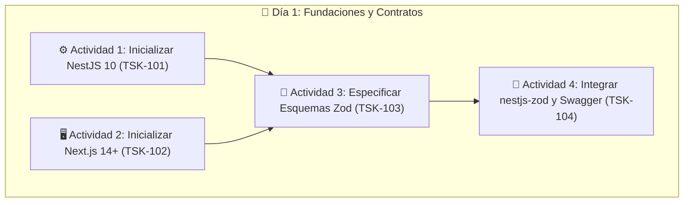

# 📐 Especificación 01: Inicialización de Workspaces (NestJS + Next.js), Tooling y Contratos Zod
**Documento:** `specs/01-contracts-and-schemas.md`  
**Épicas Relacionadas:** `EPIC-01`, `EPIC-03`, `EPIC-04`, `EPIC-05`, `EPIC-06`, `EPIC-07`, `EPIC-08`  
**Tareas del Taskboard:** `TSK-101`, `TSK-102`, `TSK-103`, `TSK-104`, `TSK-804`  
**Fase de Implementación:** Fase 1 (Día 1: Inicialización de Workspaces y Contratos SDD)  

---

## 📌 1. Objetivos del Día 1 y Metodología SDD

El **Día 1 de la Fase 1** tiene como propósito fundacional levantar la estructura física de los proyectos backend y frontend, configurar el tooling de compilación estricta y establecer la **fuente de verdad única de los contratos de dominio** mediante esquemas Zod.



---

## ⚙️ 2. Actividad 1: Inicialización del Workspace Backend (NestJS 10 + TypeScript Estricto) (`TSK-101`)

### 2.1 Comandos de Creación y Estructuración
Desde la raíz del proyecto `c:/Users/1/Desktop/Samuel/Uni-Espacios`:

```bash
# 1. Crear proyecto NestJS en la carpeta backend/
npx @nestjs/cli new backend --package-manager npm --strict --skip-git

# 2. Navegar al backend e instalar dependencias principales
cd backend

# Dependencias de producción
npm install @nestjs/config @nestjs/swagger @nestjs/jwt @nestjs/passport passport passport-jwt bcrypt cookie-parser helmet nestjs-zod zod @prisma/client

# Dependencias de desarrollo
npm install -D prisma @types/bcrypt @types/passport-jwt @types/cookie-parser @types/node typescript ts-node
```

### 2.2 Configuración Estricta de TypeScript (`backend/tsconfig.json`)
Garantiza cero uso de `any` implícito y tipado riguroso:

```json
{
  "compilerOptions": {
    "module": "commonjs",
    "declaration": true,
    "removeComments": true,
    "emitDecoratorMetadata": true,
    "experimentalDecorators": true,
    "allowSyntheticDefaultImports": true,
    "target": "ES2022",
    "sourceMap": true,
    "outDir": "./dist",
    "baseUrl": "./",
    "incremental": true,
    "skipLibCheck": true,
    "strict": true,
    "noImplicitAny": true,
    "strictNullChecks": true,
    "strictBindCallApply": true,
    "forceConsistentCasingInFileNames": true,
    "noFallthroughCasesInSwitch": true
  }
}
```

### 2.3 Estructura de Directorios Inicial en `backend/src/`
```
backend/src/
├── common/
│   ├── decorators/
│   ├── filters/
│   ├── guards/
│   ├── interceptors/
│   └── pipes/
├── config/
├── prisma/
├── schemas/               # Ubicación de los esquemas Zod de dominio
├── modules/
│   ├── auth/
│   ├── sedes/
│   ├── bloques/
│   ├── espacios/
│   ├── inventario/
│   ├── periodos-academicos/
│   ├── clases-fijas/
│   ├── disponibilidad/
│   ├── reservas/
│   ├── aprobaciones/
│   ├── verificaciones/
│   └── auditoria/
├── app.module.ts
└── main.ts
```

---

## 🖥️ 3. Actividad 2: Inicialización del Workspace Frontend (Next.js 14+ App Router + shadcn/ui) (`TSK-102`)

### 3.1 Comandos de Creación y Configuración
Desde la raíz del proyecto `c:/Users/1/Desktop/Samuel/Uni-Espacios`:

```bash
# 1. Crear proyecto Next.js en la carpeta frontend/ con App Router, TypeScript y Tailwind CSS
npx create-next-app@latest frontend \
  --typescript \
  --tailwind \
  --eslint \
  --app \
  --src-dir \
  --import-alias "@/*" \
  --use-npm

# 2. Navegar al frontend e instalar dependencias principales
cd frontend

# TanStack Query v5, Formularios, Zod y Utilidades
npm install @tanstack/react-query @tanstack/react-query-devtools react-hook-form @hookform/resolvers zod lucide-react clsx tailwind-merge date-fns sonner

# Inicializar shadcn/ui
npx shadcn@latest init -d

# Instalar componentes primitivos de shadcn/ui requeridos
npx shadcn@latest add button card dialog dropdown-menu input label select badge table tabs form toast separator
```

### 3.2 Estructura de Directorios Inicial en `frontend/src/`
```
frontend/src/
├── app/
│   ├── (auth)/
│   │   ├── login/page.tsx
│   │   └── register/page.tsx
│   ├── (dashboard)/
│   │   ├── catalogo/page.tsx
│   │   ├── espacios/[id]/page.tsx
│   │   ├── reservas/
│   │   ├── gestion/
│   │   └── admin/
│   ├── layout.tsx
│   └── page.tsx
├── components/
│   ├── ui/                    # Componentes shadcn/ui
│   ├── catalog/               # Componentes de catálogo y tarjetas
│   ├── availability/          # Rejilla horaria interactiva
│   ├── inventory/             # Lista de chequeo de implementos
│   └── reservations/          # Formularios de reserva
├── hooks/                     # Custom hooks TanStack Query
├── lib/                       # queryKeys, utils, apiClient
├── schemas/                   # Esquemas Zod compartidos para client-side forms
└── middleware.ts
```

---

## 📜 4. Actividad 3: Especificación de Esquemas Zod y Contratos de Dominio (`TSK-103`)

Todos los esquemas se ubican en la carpeta `schemas/` y son agnósticos para ser consumidos tanto por NestJS (`nestjs-zod`) como por Next.js (`@hookform/resolvers/zod`).

---

### 4.1 Contratos de Autenticación y Usuarios (`schemas/usuario.schema.ts`)

```typescript
import { z } from 'zod';

export const RolUsuarioEnum = z.enum([
  'ESTUDIANTE',
  'DOCENTE',
  'ADMINISTRATIVO',
  'GESTOR_ESPACIO',
  'SUPERADMIN',
]);
export type RolUsuario = z.infer<typeof RolUsuarioEnum>;

export const RegisterSchema = z.object({
  email: z
    .string()
    .trim()
    .toLowerCase()
    .email({ message: 'Formato de correo electrónico inválido' })
    .endsWith('@elpoli.edu.co', {
      message: 'El correo debe ser institucional con dominio @elpoli.edu.co',
    }),
  password: z
    .string()
    .min(8, { message: 'La contraseña debe tener mínimo 8 caracteres' })
    .max(64, { message: 'La contraseña no puede exceder 64 caracteres' })
    .regex(/[A-Z]/, { message: 'Debe contener al menos una letra mayúscula' })
    .regex(/[a-z]/, { message: 'Debe contener al menos una letra minúscula' })
    .regex(/[0-9]/, { message: 'Debe contener al menos un número' })
    .regex(/[^A-Za-z0-9]/, {
      message: 'Debe contener al menos un carácter especial (@, $, !, %, *, ?, &)',
    }),
  nombreCompleto: z
    .string()
    .trim()
    .min(3, { message: 'El nombre completo debe tener al menos 3 caracteres' })
    .max(100, { message: 'El nombre completo no puede superar 100 caracteres' }),
  rol: RolUsuarioEnum.default('ESTUDIANTE'),
  documentoIdentidad: z
    .string()
    .trim()
    .min(6, { message: 'El documento de identidad debe tener al menos 6 caracteres' })
    .max(20, { message: 'El documento de identidad no puede superar 20 caracteres' }),
  telefono: z
    .string()
    .trim()
    .regex(/^\+?[0-9]{7,15}$/, { message: 'Formato de teléfono inválido' })
    .optional(),
});
export type RegisterInput = z.infer<typeof RegisterSchema>;

export const LoginSchema = z.object({
  email: z
    .string()
    .trim()
    .toLowerCase()
    .email({ message: 'Formato de correo inválido' })
    .endsWith('@elpoli.edu.co', {
      message: 'El correo debe ser institucional (@elpoli.edu.co)',
    }),
  password: z
    .string()
    .min(1, { message: 'La contraseña es obligatoria' }),
});
export type LoginInput = z.infer<typeof LoginSchema>;

export const UsuarioResponseSchema = z.object({
  id: z.number().int().positive(),
  email: z.string().email(),
  nombreCompleto: z.string(),
  rol: RolUsuarioEnum,
  documentoIdentidad: z.string(),
  telefono: z.string().nullable().optional(),
  activo: z.boolean(),
  inhabilitadoParaReservar: z.boolean(),
  motivoInhabilitacion: z.string().nullable().optional(),
  creadoEn: z.string().datetime(),
  actualizadoEn: z.string().datetime(),
});
export type UsuarioResponse = z.infer<typeof UsuarioResponseSchema>;

export const AuthResponseSchema = z.object({
  accessToken: z.string(),
  usuario: UsuarioResponseSchema,
});
export type AuthResponse = z.infer<typeof AuthResponseSchema>;
```

---

### 4.2 Contratos de Infraestructura Física (`schemas/espacio.schema.ts`)

```typescript
export const TipoEspacioEnum = z.enum([
  'AULA',
  'LABORATORIO',
  'AUDITORIO',
  'DEPORTIVO',
  'SALA_COMPUTO',
]);
export type TipoEspacio = z.infer<typeof TipoEspacioEnum>;

export const EstadoEspacioEnum = z.enum([
  'ACTIVO',
  'EN_MANTENIMIENTO',
  'INACTIVO',
]);
export type EstadoEspacio = z.infer<typeof EstadoEspacioEnum>;

export const SedeSchema = z.object({
  id: z.number().int().positive().optional(),
  nombre: z.string().trim().min(3).max(100),
  ciudad: z.string().trim().min(2).max(60),
  direccion: z.string().trim().min(5).max(150),
});
export type Sede = z.infer<typeof SedeSchema>;

export const BloqueSchema = z.object({
  id: z.number().int().positive().optional(),
  sedeId: z.number().int().positive({ message: 'Debe especificar una sede válida' }),
  codigo: z.string().trim().min(1).max(20), // Ej: "P40", "P31", "Bloque A"
  descripcion: z.string().trim().max(200).optional(),
});
export type Bloque = z.infer<typeof BloqueSchema>;

export const CreateEspacioSchema = z.object({
  bloqueId: z.number().int().positive({ message: 'ID de bloque requerido' }),
  identificador: z
    .string()
    .trim()
    .min(2, { message: 'El identificador debe tener al menos 2 caracteres' })
    .max(30), // Ej: "P40-201", "Cancha Sintética 1"
  tipo: TipoEspacioEnum,
  capacidad: z
    .number()
    .int()
    .positive({ message: 'La capacidad debe ser un entero positivo' })
    .min(1)
    .max(5000),
  piso: z.number().int().optional(),
  ubicacionDetalle: z.string().trim().max(200).optional(),
  permiteReservaDirecta: z.boolean().default(false),
  estado: EstadoEspacioEnum.default('ACTIVO'),
});
export type CreateEspacioInput = z.infer<typeof CreateEspacioSchema>;

export const UpdateEspacioSchema = CreateEspacioSchema.partial();
export type UpdateEspacioInput = z.infer<typeof UpdateEspacioSchema>;

export const EspacioFiltrosQuerySchema = z.object({
  sedeId: z.coerce.number().int().positive().optional(),
  bloqueId: z.coerce.number().int().positive().optional(),
  tipo: TipoEspacioEnum.optional(),
  capacidadMin: z.coerce.number().int().min(1).optional(),
  estado: EstadoEspacioEnum.optional(),
  categoriaImplemento: z.enum(['TECNOLOGIA', 'MOBILIARIO', 'DEPORTIVO', 'DIDACTICO']).optional(),
  search: z.string().trim().optional(),
  page: z.coerce.number().int().min(1).default(1),
  limit: z.coerce.number().int().min(1).max(100).default(10),
});
export type EspacioFiltrosQuery = z.infer<typeof EspacioFiltrosQuerySchema>;
```

---

### 4.3 Contratos de Inventario e Implementos (`schemas/inventario.schema.ts`)

```typescript
export const CategoriaItemEnum = z.enum([
  'TECNOLOGIA',
  'MOBILIARIO',
  'DEPORTIVO',
  'DIDACTICO',
]);
export type CategoriaItem = z.infer<typeof CategoriaItemEnum>;

export const EstadoItemEnum = z.enum([
  'OPTIMO',
  'REGULAR',
  'DANADO',
  'DE_BAJA',
]);
export type EstadoItem = z.infer<typeof EstadoItemEnum>;

export const CreateItemInventarioSchema = z.object({
  espacioId: z.number().int().positive({ message: 'ID de espacio requerido' }),
  codigo: z
    .string()
    .trim()
    .min(2, { message: 'El código o placa de inventario es requerido' })
    .max(50), // Ej: "INV-P40-TV01", "BAL-FUT-05"
  nombre: z
    .string()
    .trim()
    .min(2, { message: 'Nombre del implemento requerido' })
    .max(100),
  categoria: CategoriaItemEnum,
  cantidad: z
    .number()
    .int()
    .min(1, { message: 'La cantidad debe ser al menos 1' })
    .default(1),
  estado: EstadoItemEnum.default('OPTIMO'),
  esCritico: z.boolean().default(false),
  descripcion: z.string().trim().max(255).optional(),
});
export type CreateItemInventarioInput = z.infer<typeof CreateItemInventarioSchema>;

export const UpdateItemInventarioSchema = CreateItemInventarioSchema.partial().omit({
  espacioId: true,
});
export type UpdateItemInventarioInput = z.infer<typeof UpdateItemInventarioSchema>;

export const ItemInventarioResponseSchema = z.object({
  id: z.number().int().positive(),
  espacioId: z.number().int().positive(),
  codigo: z.string(),
  nombre: z.string(),
  categoria: CategoriaItemEnum,
  cantidad: z.number().int(),
  estado: EstadoItemEnum,
  esCritico: z.boolean(),
  descripcion: z.string().nullable().optional(),
  creadoEn: z.string().datetime(),
  actualizadoEn: z.string().datetime(),
});
export type ItemInventarioResponse = z.infer<typeof ItemInventarioResponseSchema>;
```

---

### 4.4 Contratos de Calendario Académico y Clases Fijas (`schemas/calendario.schema.ts`)

```typescript
const timeRegex = /^([01]\d|2[0-3]):([0-5]\d)$/;

export const EstadoPeriodoEnum = z.enum([
  'PLANIFICACION',
  'ACTIVO',
  'FINALIZADO',
]);
export type EstadoPeriodo = z.infer<typeof EstadoPeriodoEnum>;

export const PeriodoAcademicoSchema = z
  .object({
    id: z.number().int().positive().optional(),
    codigo: z
      .string()
      .trim()
      .regex(/^\d{4}-[1-2]$/, { message: 'Formato de periodo debe ser YYYY-1 o YYYY-2 (Ej: 2026-2)' }),
    fechaInicio: z.string().datetime({ message: 'Fecha de inicio en formato ISO 8601 requerida' }),
    fechaFin: z.string().datetime({ message: 'Fecha de fin en formato ISO 8601 requerida' }),
    estado: EstadoPeriodoEnum.default('PLANIFICACION'),
  })
  .refine(
    (data) => new Date(data.fechaFin) > new Date(data.fechaInicio),
    {
      message: 'La fecha de fin debe ser posterior a la fecha de inicio del periodo',
      path: ['fechaFin'],
    }
  );
export type PeriodoAcademicoInput = z.infer<typeof PeriodoAcademicoSchema>;

export const CreateClaseFijaSchema = z
  .object({
    espacioId: z.number().int().positive({ message: 'ID de espacio requerido' }),
    periodoId: z.number().int().positive({ message: 'ID de periodo académico requerido' }),
    diaSemana: z
      .number()
      .int()
      .min(1, { message: 'Día de la semana: 1 (Lunes)' })
      .max(7, { message: 'Día de la semana: 7 (Domingo)' }),
    horaInicio: z
      .string()
      .regex(timeRegex, { message: 'horaInicio debe tener formato HH:mm (Ej: 08:00)' }),
    horaFin: z
      .string()
      .regex(timeRegex, { message: 'horaFin debe tener formato HH:mm (Ej: 10:00)' }),
    asignatura: z.string().trim().min(2).max(100),
    docente: z.string().trim().min(3).max(100),
    grupo: z.string().trim().max(20).optional(),
  })
  .refine(
    (data) => {
      const [hIni, mIni] = data.horaInicio.split(':').map(Number);
      const [hFin, mFin] = data.horaFin.split(':').map(Number);
      return hFin * 60 + mFin > hIni * 60 + mIni;
    },
    {
      message: 'horaFin debe ser estrictamente posterior a horaInicio',
      path: ['horaFin'],
    }
  );
export type CreateClaseFijaInput = z.infer<typeof CreateClaseFijaSchema>;

export const BulkCreateClaseFijaSchema = z.object({
  clases: z.array(CreateClaseFijaSchema).min(1, { message: 'Debe enviar al menos una clase fija' }),
});
export type BulkCreateClaseFijaInput = z.infer<typeof BulkCreateClaseFijaSchema>;
```

---

### 4.5 Contratos de Reservas y Disponibilidad (`schemas/reserva.schema.ts`)

```typescript
export const EstadoReservaEnum = z.enum([
  'PENDIENTE',
  'APROBADA',
  'RECHAZADA',
  'CANCELADA',
  'EN_USO',
  'FINALIZADA',
]);
export type EstadoReserva = z.infer<typeof EstadoReservaEnum>;

export const CrearReservaSchema = z
  .object({
    espacioId: z.number().int().positive({ message: 'ID de espacio requerido' }),
    fechaInicio: z
      .string()
      .datetime({ message: 'fechaInicio debe ser formato ISO 8601 (Ej: 2026-09-01T08:00:00Z)' }),
    fechaFin: z
      .string()
      .datetime({ message: 'fechaFin debe ser formato ISO 8601 (Ej: 2026-09-01T10:00:00Z)' }),
    motivo: z
      .string()
      .trim()
      .min(5, { message: 'El motivo debe tener al menos 5 caracteres' })
      .max(300, { message: 'El motivo no puede superar 300 caracteres' }),
    cantidadAsistentesEstimada: z.number().int().positive().optional(),
  })
  .refine(
    (data) => new Date(data.fechaFin) > new Date(data.fechaInicio),
    {
      message: 'fechaFin debe ser posterior a fechaInicio',
      path: ['fechaFin'],
    }
  )
  .refine(
    (data) => {
      const duracionMs = new Date(data.fechaFin).getTime() - new Date(data.fechaInicio).getTime();
      const duracionHoras = duracionMs / (1000 * 60 * 60);
      return duracionHoras <= 6;
    },
    {
      message: 'La reserva no puede exceder las 6 horas de duración continua',
      path: ['fechaFin'],
    }
  );
export type CrearReservaInput = z.infer<typeof CrearReservaSchema>;

export const CambiarEstadoReservaSchema = z
  .object({
    estado: z.enum(['APROBADA', 'RECHAZADA', 'CANCELADA']),
    observaciones: z.string().trim().max(300).optional(),
  })
  .refine(
    (data) => {
      if (data.estado === 'RECHAZADA' && (!data.observaciones || data.observaciones.length < 5)) {
        return false;
      }
      return true;
    },
    {
      message: 'Es obligatorio proporcionar una justificación (mínimo 5 caracteres) al rechazar una reserva',
      path: ['observaciones'],
    }
  );
export type CambiarEstadoReservaInput = z.infer<typeof CambiarEstadoReservaSchema>;

export const ConsultaDisponibilidadQuerySchema = z.object({
  fecha: z
    .string()
    .regex(/^\d{4}-\d{2}-\d{2}$/, { message: 'La fecha debe tener formato YYYY-MM-DD' }),
});
export type ConsultaDisponibilidadQuery = z.infer<typeof ConsultaDisponibilidadQuerySchema>;
```

---

### 4.6 Contratos de Verificación de Inventario (`schemas/verificacion.schema.ts`)

```typescript
export const TipoVerificacionEnum = z.enum(['CHECK_IN', 'CHECK_OUT']);
export type TipoVerificacion = z.infer<typeof TipoVerificacionEnum>;

export const EstadoGeneralVerificacionEnum = z.enum([
  'CONFORME',
  'NO_CONFORME',
  'CON_NOVEDADES',
]);
export type EstadoGeneralVerificacion = z.infer<typeof EstadoGeneralVerificacionEnum>;

export const EstadoItemVerificacionEnum = z.enum([
  'PRESENTE_OPTIMO',
  'PRESENTE_DANADO',
  'FALTANTE',
]);
export type EstadoItemVerificacion = z.infer<typeof EstadoItemVerificacionEnum>;

export const DetalleVerificacionItemSchema = z.object({
  itemInventarioId: z.number().int().positive({ message: 'ID de implemento requerido' }),
  estadoItem: EstadoItemVerificacionEnum,
  cantidadEncontrada: z
    .number()
    .int()
    .min(0, { message: 'La cantidad encontrada no puede ser negativa' }),
  observacionNovedad: z.string().trim().max(300).optional(),
});
export type DetalleVerificacionItemInput = z.infer<typeof DetalleVerificacionItemSchema>;

export const CheckInSchema = z.object({
  observacionesGenerales: z.string().trim().max(500).optional(),
  items: z
    .array(DetalleVerificacionItemSchema)
    .min(1, { message: 'Debe verificar al menos un ítem del inventario del espacio' }),
});
export type CheckInInput = z.infer<typeof CheckInSchema>;

export const CheckOutSchema = z.object({
  observacionesGenerales: z.string().trim().max(500).optional(),
  items: z
    .array(DetalleVerificacionItemSchema)
    .min(1, { message: 'Debe verificar al menos un ítem del inventario para la entrega' }),
});
export type CheckOutInput = z.infer<typeof CheckOutSchema>;
```

---

## 🔌 5. Actividad 4: Integración Técnica de `nestjs-zod` y Swagger (`TSK-104`)

Para que NestJS valide automáticamente los payloads HTTP y exponga los metadatos en Swagger a partir de los esquemas Zod:

### 5.1 Creación de Clases DTO con `createZodDto`
```typescript
// backend/src/modules/auth/dto/login.dto.ts
import { createZodDto } from 'nestjs-zod';
import { LoginSchema } from '../../../schemas/usuario.schema';

export class LoginDto extends createZodDto(LoginSchema) {}
```

```typescript
// backend/src/modules/reservas/dto/crear-reserva.dto.ts
import { createZodDto } from 'nestjs-zod';
import { CrearReservaSchema } from '../../../schemas/reserva.schema';

export class CrearReservaDto extends createZodDto(CrearReservaSchema) {}
```

### 5.2 Registro de Parche Swagger y Pipe en `backend/src/main.ts`
```typescript
import { patchNestJsSwagger, ZodValidationPipe } from 'nestjs-zod';

// Habilitar compatibilidad de tipos Zod -> OpenAPI Swagger
patchNestJsSwagger();

// Registrar Pipe global de validación Zod
app.useGlobalPipes(new ZodValidationPipe());
```

---

## 🌐 6. Formato Estándar de Respuestas y Errores de API

### 6.1 Envoltura de Respuesta Exitosa (`ApiResponse<T>`)
```typescript
export interface ApiResponse<T> {
  success: true;
  statusCode: number;
  message: string;
  data: T;
  meta?: {
    total?: number;
    page?: number;
    limit?: number;
    totalPages?: number;
  };
}
```

### 6.2 Envoltura Estándar de Error de API (`ApiErrorResponse`)
```typescript
export interface ApiErrorResponse {
  success: false;
  statusCode: number;
  error: string;
  message: string | string[];
  timestamp: string;
  path: string;
  details?: Array<{
    field: string;
    message: string;
  }>;
}
```
