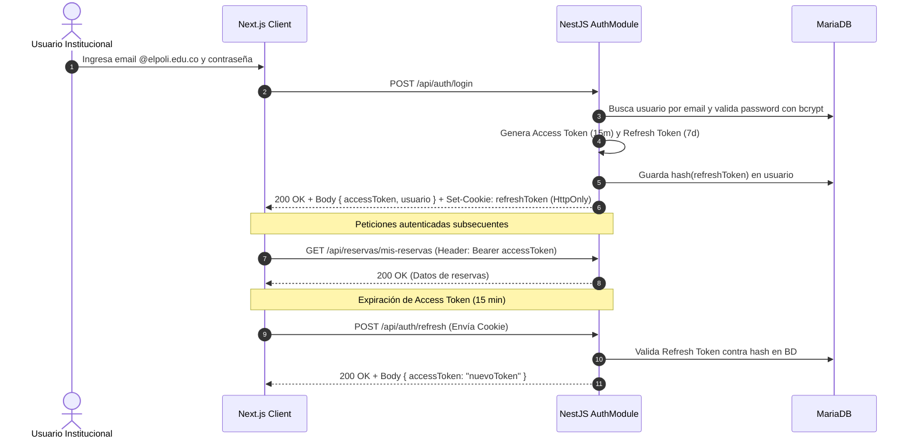

# 🔒 Especificación 04: Seguridad, Autenticación JWT y Matriz RBAC
**Documento:** `specs/04-security-and-rbac.md`  
**Épicas Relacionadas:** `EPIC-03`  
**Tareas del Taskboard:** `TSK-301`, `TSK-302`, `TSK-303`, `TSK-304`  
**Fase de Implementación:** Fase 1 (Día 4)  

---

## 📌 1. Estrategia de Autenticación Dual JWT

El sistema implementa autenticación institucional segura basada en tokens JWT con rotación y separación de responsabilidades:

1. **Access Token:**
   * **Vigencia:** 15 minutos.
   * **Transporte:** Header `Authorization: Bearer <accessToken>`.
   * **Payload:** `{ sub: number, email: string, rol: RolUsuario, nombreCompleto: string }`.
   * **Firmado con:** Algoritmo `HS256` utilizando `JWT_ACCESS_SECRET`.
2. **Refresh Token:**
   * **Vigencia:** 7 días.
   * **Transporte:** Cookie `HttpOnly`, `Secure` (en producción), `SameSite=Strict`, con path `/api/auth/refresh`.
   * **Almacenamiento en BD:** Hash bcrypt en el campo `refreshTokenHash` de la tabla `Usuario`.
   * **Firmado con:** `JWT_REFRESH_SECRET`.



---

## 👥 2. Matriz Exhaustiva de Roles y Permisos (RBAC)

| Módulo / Acción | ESTUDIANTE | DOCENTE / ADM | GESTOR_ESPACIO | SUPERADMIN |
| :--- | :---: | :---: | :---: | :---: |
| **Catálogo:** Consultar sedes, bloques, espacios y ficha de inventario | ✅ | ✅ | ✅ | ✅ |
| **Disponibilidad:** Consultar disponibilidad horaria en tiempo real | ✅ | ✅ | ✅ | ✅ |
| **Reservas:** Crear solicitud puntual de reserva | ✅ | ✅ | ✅ | ✅ |
| **Reservas:** Consultar y cancelar sus propias reservas | ✅ | ✅ | ✅ | ✅ |
| **Check-In / Check-Out:** Realizar verificación de inventario de su reserva | ✅ | ✅ | ✅ | ✅ |
| **Aprobaciones:** Dictaminar reservas de su bloque/facultad asignada | ❌ | ❌ | ✅ | ✅ |
| **Inventario:** Registrar y modificar implementos de su bloque | ❌ | ❌ | ✅ | ✅ |
| **Novedades:** Consultar reporte global de implementos dañados o faltantes | ❌ | ❌ | ✅ | ✅ |
| **Infraestructura:** Crear / Modificar Sedes, Bloques y Espacios | ❌ | ❌ | ❌ | ✅ |
| **Calendario:** Crear / Activar Periodos Académicos y Clases Fijas | ❌ | ❌ | ❌ | ✅ |
| **Auditoría:** Consultar registro histórico de auditoría global del sistema | ❌ | ❌ | ❌ | ✅ |
| **Usuarios:** Inhabilitar o rehabilitar usuarios para realizar reservas | ❌ | ❌ | ✅ | ✅ |

---

## 🛠️ 3. Decoradores y Guards Personalizados en NestJS

### 3.1 Decorador `@Roles(...)` y `@Public()`
```typescript
// backend/src/common/decorators/roles.decorator.ts
import { SetMetadata } from '@nestjs/common';
import { RolUsuario } from '@prisma/client';

export const ROLES_KEY = 'roles';
export const Roles = (...roles: RolUsuario[]) => SetMetadata(ROLES_KEY, roles);

export const IS_PUBLIC_KEY = 'isPublic';
export const Public = () => SetMetadata(IS_PUBLIC_KEY, true);
```

### 3.2 Decorador `@CurrentUser()`
```typescript
// backend/src/common/decorators/current-user.decorator.ts
import { createParamDecorator, ExecutionContext } from '@nestjs/common';

export interface JwtPayload {
  sub: number;
  email: string;
  rol: string;
  nombreCompleto: string;
}

export const CurrentUser = createParamDecorator(
  (data: keyof JwtPayload | undefined, ctx: ExecutionContext) => {
    const request = ctx.switchToHttp().getRequest();
    const user = request.user as JwtPayload;
    return data ? user?.[data] : user;
  }
);
```

### 3.3 Guard de Autenticación JWT (`JwtAuthGuard`)
```typescript
// backend/src/common/guards/jwt-auth.guard.ts
import { Injectable, ExecutionContext, UnauthorizedException } from '@nestjs/common';
import { AuthGuard } from '@nestjs/passport';
import { Reflector } from '@nestjs/core';
import { IS_PUBLIC_KEY } from '../decorators/roles.decorator';

@Injectable()
export class JwtAuthGuard extends AuthGuard('jwt') {
  constructor(private reflector: Reflector) {
    super();
  }

  canActivate(context: ExecutionContext) {
    const isPublic = this.reflector.getAllAndOverride<boolean>(IS_PUBLIC_KEY, [
      context.getHandler(),
      context.getClass(),
    ]);
    if (isPublic) {
      return true;
    }
    return super.canActivate(context);
  }

  handleRequest(err: any, user: any) {
    if (err || !user) {
      throw new UnauthorizedException('Token de acceso inválido o no proporcionado');
    }
    return user;
  }
}
```

### 3.4 Guard de Roles (`RolesGuard`)
```typescript
// backend/src/common/guards/roles.guard.ts
import { Injectable, CanActivate, ExecutionContext, ForbiddenException } from '@nestjs/common';
import { Reflector } from '@nestjs/core';
import { RolUsuario } from '@prisma/client';
import { ROLES_KEY } from '../decorators/roles.decorator';

@Injectable()
export class RolesGuard implements CanActivate {
  constructor(private reflector: Reflector) {}

  canActivate(context: ExecutionContext): boolean {
    const requiredRoles = this.reflector.getAllAndOverride<RolUsuario[]>(ROLES_KEY, [
      context.getHandler(),
      context.getClass(),
    ]);

    if (!requiredRoles || requiredRoles.length === 0) {
      return true; // Si no requiere rol específico, permite acceso a cualquier autenticado
    }

    const { user } = context.switchToHttp().getRequest();
    if (!user || !user.rol) {
      throw new ForbiddenException('No posee permisos suficientes para este recurso');
    }

    // SUPERADMIN tiene acceso universal a todas las rutas protegidas
    if (user.rol === 'SUPERADMIN') {
      return true;
    }

    const hasRole = requiredRoles.includes(user.rol as RolUsuario);
    if (!hasRole) {
      throw new ForbiddenException(`Se requiere uno de los siguientes roles: ${requiredRoles.join(', ')}`);
    }

    return true;
  }
}
```

---

## 🛡️ 4. Reglas de Inhabilitación de Usuario por Novedades de Inventario

1. **Inhabilitación Preventiva Automática:**
   * Cuando un usuario entrega un espacio en **Check-Out** y se detecta un ítem `FALTANTE` o `PRESENTE_DANADO`, el sistema actualiza:
     ```prisma
     await tx.usuario.update({
       where: { id: solicitanteId },
       data: {
         inhabilitadoParaReservar: true,
         motivoInhabilitacion: `Novedad reportada en reserva #${reservaId} (${novedadesResumen})`
       }
     });
     ```
2. **Restricción de Creación de Reservas:**
   * En `POST /api/reservas`, el servicio verifica si `usuario.inhabilitadoParaReservar === true`. En caso afirmativo, rechaza la solicitud con código `HTTP 403 Forbidden` y el motivo de la sanción.
3. **Rehabilitación:**
   * Únicamente un `GESTOR_ESPACIO` o `SUPERADMIN` puede remover la sanción tras el esclarecimiento o reposición del implemento mediante `PATCH /api/usuarios/:id/rehabilitar`.

---

## 🛑 5. Hardening de Seguridad y Limitación de Tasa (Rate Limiting)

1. **Throttler / Rate Limiter:**
   * General: Máximo 100 peticiones por minuto por IP.
   * Endpoints de Auth (`/api/auth/login` y `/api/auth/register`): Máximo 5 intentos por minuto para prevenir ataques de fuerza bruta.
2. **Cabeceras HTTP Seguras con Helmet:**
   * `X-Frame-Options: DENY` (Anti Clickjacking).
   * `X-Content-Type-Options: nosniff`.
   * `Strict-Transport-Security: max-age=31536000; includeSubDomains`.
3. **CORS Restrictivo:**
   * Origen exclusivo para el dominio del frontend (`http://localhost:3000` en desarrollo, `https://espacios.elpoli.edu.co` en producción).
