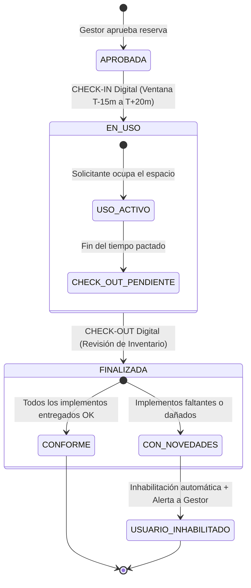

# 📦 Especificación 06: Módulo de Inventario, Flujo de Check-In / Check-Out y Novedades
**Documento:** `specs/06-inventory-checkin-checkout-flow.md`  
**Épicas Relacionadas:** `EPIC-07`, `EPIC-06`  
**Tareas del Taskboard:** `TSK-701`, `TSK-702`, `TSK-703`, `TSK-704`, `TSK-705`  
**Fase de Implementación:** Fase 4 (Días 14, 15)  

---

## 📌 1. Visión y Custodia de Implementos Institucionales

La custodia de los recursos pedagógicos y deportivos es un pilar crítico de **Uni-Espacios**. Cada espacio físico posee una ficha de inventario asignada (balones, televisores, proyectores, marcadores, cables, osciloscopios, etc.). 

El sistema implementa un **acta digital de entrega y recepción (Check-In y Check-Out)** que responsabiliza al usuario durante su reserva y previene pérdidas o deterioros no reportados.



---

## ⏰ 2. Reglas de Negocio del Flujo de Check-In (`TSK-702`)

### 2.1 Ventana Temporal de Habilitación
* El botón y endpoint de Check-In únicamente se habilitan dentro de la siguiente ventana respecto a la hora de inicio pactada ($T_{ini}$):
  $$T_{ini} - 15\text{ minutos} \le T_{\text{actual}} \le T_{ini} + 20\text{ minutos}$$
* Si $T_{\text{actual}} < T_{ini} - 15\text{m}$, el sistema responde `HTTP 400 Bad Request: "El Check-In aún no está habilitado (disponible 15 min antes)"`.
* Si $T_{\text{actual}} > T_{ini} + 20\text{m}$ y no se hizo Check-In, la reserva puede ser marcada como cancelada por inasistencia (*No-Show*).

### 2.2 Lista de Chequeo Base (Baseline)
1. El solicitante (o el gestor) recibe la lista completa de ítems asignados al espacio físico.
2. Para cada ítem, se valida su presencia física y estado operativo actual (`PRESENTE_OPTIMO`, `PRESENTE_DANADO`, `FALTANTE`).
3. **Registro de Novedad Previa:** Si un implemento ya se encontraba dañado o ausente antes de ingresar, se documenta en el acta de Check-In con observaciones para no responsabilizar al solicitante actual.
4. **Transición de Estado:** Al confirmarse el Check-In, la reserva pasa automáticamente a estado `EN_USO`.

---

## 🔍 3. Reglas de Negocio del Flujo de Check-Out y Novedades (`TSK-703`)

### 3.1 Momento de Ejecución
* Debe ejecutarse al concluir el intervalo de la reserva (hasta máximo 30 minutos posteriores a $T_{fin}$).
* El usuario o gestor vuelve a inspeccionar ítem por ítem el inventario del espacio.

### 3.2 Algoritmo de Detección de Novedades y Sanciones
Para cada ítem en el Check-Out:
1. Se compara el estado registrado en Check-Out contra el estado de ingreso en Check-In.
2. **Detección de Daño / Pérdida:**
   * Si en Check-In estaba `PRESENTE_OPTIMO` y en Check-Out se marca `PRESENTE_DANADO` o `FALTANTE`.
   * O si la cantidad devuelta es menor que la cantidad entregada.
3. **Acciones Automáticas del Sistema:**
   * La verificación se cataloga como `CON_NOVEDADES`.
   * El estado del ítem en `ItemInventario` se actualiza a `DANADO` o se reduce su cantidad.
   * El usuario solicitante pasa a `inhabilitadoParaReservar = true` con su respectivo `motivoInhabilitacion`.
   * Se genera un registro de auditoría con la novedad para la bandeja del `GESTOR_ESPACIO`.

---

## 💻 4. Implementación Transaccional en NestJS (`VerificacionesService`)

```typescript
// backend/src/modules/verificaciones/verificaciones.service.ts
import { Injectable, BadRequestException, ForbiddenException, NotFoundException } from '@nestjs/common';
import { PrismaService } from '../../prisma/prisma.service';
import { CheckInInput, CheckOutInput } from '../../schemas/verificacion.schema';
import { Prisma } from '@prisma/client';

@Injectable()
export class VerificacionesService {
  constructor(private readonly prisma: PrismaService) {}

  // ----------------------------------------------------
  // REGISTRAR CHECK-IN
  // ----------------------------------------------------
  async registrarCheckIn(reservaId: number, usuarioId: number, dto: CheckInInput) {
    return this.prisma.$transaction(async (tx) => {
      const reserva = await tx.reserva.findUnique({
        where: { id: reservaId },
        include: { espacio: { include: { inventario: true } } },
      });

      if (!reserva) throw new NotFoundException('Reserva no encontrada');
      if (reserva.estado !== 'APROBADA') {
        throw new BadRequestException(`No se puede hacer Check-In en estado ${reserva.estado}`);
      }

      // Validar ventana de tiempo (15 min antes hasta 20 min después)
      const ahora = new Date().getTime();
      const tIni = new Date(reserva.fechaInicio).getTime();
      const ventanaIni = tIni - 15 * 60 * 1000;
      const ventanaFin = tIni + 20 * 60 * 1000;

      if (ahora < ventanaIni || ahora > ventanaFin) {
        throw new BadRequestException('El Check-In se encuentra fuera de la ventana horaria permitida');
      }

      // Crear VerificacionInventario
      const verificacion = await tx.verificacionInventario.create({
        data: {
          reservaId,
          usuarioVerificadorId: usuarioId,
          tipo: 'CHECK_IN',
          estadoGeneral: 'CONFORME',
          observaciones: dto.observacionesGenerales,
          detalles: {
            create: dto.items.map((it) => ({
              itemInventarioId: it.itemInventarioId,
              estadoItem: it.estadoItem,
              cantidadEncontrada: it.cantidadEncontrada,
              observacionNovedad: it.observacionNovedad,
            })),
          },
        },
        include: { detalles: true },
      });

      // Transicionar reserva a EN_USO
      await tx.reserva.update({
        where: { id: reservaId },
        data: { estado: 'EN_USO' },
      });

      return verificacion;
    });
  }

  // ----------------------------------------------------
  // REGISTRAR CHECK-OUT
  // ----------------------------------------------------
  async registrarCheckOut(reservaId: number, usuarioId: number, dto: CheckOutInput) {
    return this.prisma.$transaction(async (tx) => {
      const reserva = await tx.reserva.findUnique({
        where: { id: reservaId },
        include: { espacio: { include: { inventario: true } } },
      });

      if (!reserva) throw new NotFoundException('Reserva no encontrada');
      if (reserva.estado !== 'EN_USO') {
        throw new BadRequestException(`No se puede hacer Check-Out si la reserva no está EN_USO`);
      }

      // Evaluar si existen novedades (ítems dañados o faltantes)
      const novedades = dto.items.filter(
        (i) => i.estadoItem === 'PRESENTE_DANADO' || i.estadoItem === 'FALTANTE'
      );
      const hayNovedades = novedades.length > 0;
      const estadoGeneral = hayNovedades ? 'CON_NOVEDADES' : 'CONFORME';

      const verificacion = await tx.verificacionInventario.create({
        data: {
          reservaId,
          usuarioVerificadorId: usuarioId,
          tipo: 'CHECK_OUT',
          estadoGeneral,
          observaciones: dto.observacionesGenerales,
          detalles: {
            create: dto.items.map((it) => ({
              itemInventarioId: it.itemInventarioId,
              estadoItem: it.estadoItem,
              cantidadEncontrada: it.cantidadEncontrada,
              observacionNovedad: it.observacionNovedad,
            })),
          },
        },
        include: { detalles: true },
      });

      // Si hubo novedades, actualizar ítems e inhabilitar usuario solicitante
      if (hayNovedades) {
        for (const nov of novedades) {
          if (nov.estadoItem === 'PRESENTE_DANADO') {
            await tx.itemInventario.update({
              where: { id: nov.itemInventarioId },
              data: { estado: 'DANADO' },
            });
          }
        }

        await tx.usuario.update({
          where: { id: reserva.usuarioId },
          data: {
            inhabilitadoParaReservar: true,
            motivoInhabilitacion: `Novedad de inventario en Reserva #${reservaId} (${novedades.length} implementos afectados)`,
          },
        });
      }

      // Transicionar reserva a FINALIZADA
      await tx.reserva.update({
        where: { id: reservaId },
        data: { estado: 'FINALIZADA' },
      });

      return verificacion;
    });
  }
}
```

---

## 🖥️ 5. Componentes Frontend de Verificación (`TSK-704`)

El frontend implementa una interfaz interactiva de lista de chequeo (`InventoryChecklist`):
* **Identificación del Ítem:** Nombre, Placa/Código, Categoría (Iconos para Tecnología, Balones, Mobiliario).
* **Selector de Estado:** Botones radiales rápidos (`Óptimo`, `Dañado`, `Faltante`).
* **Campo de Novedades:** Input condicional que se expande si el estado es diferente de óptimo para describir el daño.
* **Resumen de Entrega:** Modal de confirmación antes del envío final a TanStack Query.
